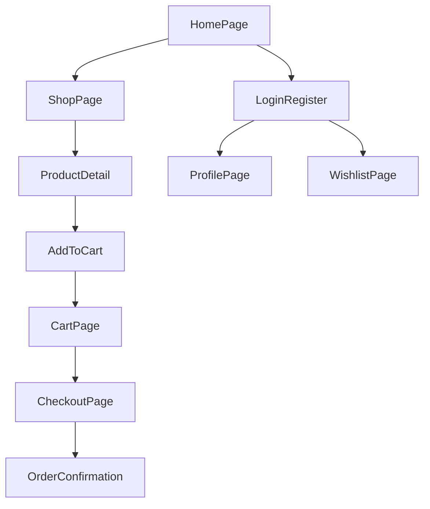

# SoleDrop (Django E-commerce)

SoleDrop is a basic shoe shopping website built with Django.
Users can register, login, browse products, add items to cart, and go to checkout.

## Tech Stack

- Python + Django 5
- SQLite database
- Django templates (HTML)
- CSS + JavaScript in `static/`

## Project Apps

- `accounts` - user register/login/profile/wishlist
- `products` - product listing and product detail page
- `cart` - cart, add/update/remove items
- `orders` - checkout and coupon endpoint

## Setup Workflow (Run Project)

1. Create virtual environment:
   - Windows: `python -m venv venv`
2. Activate virtual environment:
   - PowerShell: `venv\Scripts\Activate.ps1`
3. Install packages:
   - `pip install -r requirements.txt`
4. Run migrations:
   - `python manage.py migrate`
5. (Optional) Create admin user:
   - `python manage.py createsuperuser`
6. Start server:
   - `python manage.py runserver`
7. Open:
   - `http://127.0.0.1:8000/`

## App Workflow (User Flow)

## Implemented Functions (Working)

### accounts/views.py
- `user_registration()` - create new user
- `user_login()` - login user
- `home()` - home page with cart count
- `profile()` - show user profile + cart items
- `wishlist()` - show wishlist
- `wishlist_toggle()` - add/remove wishlist item
- `clear_wishlist()` - clear wishlist
- `user_logout()` - logout user

### products/views.py
- `product_list()` - show active products with pagination
- `home_page()` - show categories + featured products
- `deals()` - deals page
- `product_detail()` - show one product by slug

### cart/views.py
- `cart_detail()` - show cart items and subtotal
- `add_to_cart()` - add product variant to cart
- `update_cart()` - increase/decrease cart item quantity
- `remove_from_cart()` - remove item from cart
- `clear_cart()` - remove all cart items

### orders/views.py
- `checkout()` - GET checkout page, POST confirmation page
- `apply_coupon()` - simple success response endpoint

## Left To Implement (Pending)

- `profile_edit()` in `accounts/views.py` is placeholder only.
- `change_password()` in `accounts/views.py` is placeholder only.
- Real order creation is not implemented in `orders/views.py` (only confirmation page render).
- Coupon logic is not implemented (`apply_coupon()` only returns text response).
- Test files are mostly default boilerplate (`# Create your tests here.`).

## Known Bugs / Risks

- `accounts/views.py -> profile()` can crash if user has no cart:
  - It calls `.first().items...` without checking if cart exists.
- `products/views.py -> home_page()` has the same no-cart crash risk for logged-in users.
- `cart/views.py -> cart_detail()` can crash if no cart exists (same `.first().items...` pattern).
- `cart/views.py -> update_cart()` when quantity is 1 and user clicks decrease:
  - item is not decreased or removed, only redirects.
- `soledrop/settings.py` is development-only right now:
  - `DEBUG=True`, `ALLOWED_HOSTS=[]`, and hardcoded `SECRET_KEY`.

## Quick Next Steps

1. Fix all no-cart crash points with safe `None` checks.
2. Complete `profile_edit()` and `change_password()` features.
3. Implement real order save flow in checkout.
4. Implement real coupon validation and discount logic.
5. Add unit tests for each app (`accounts`, `products`, `cart`, `orders`).

